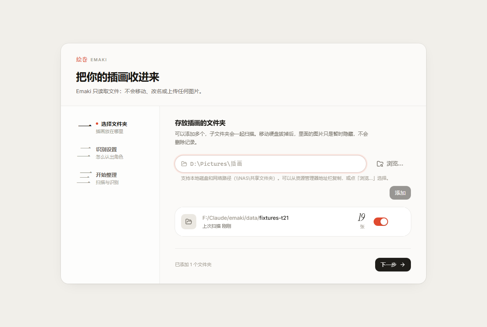
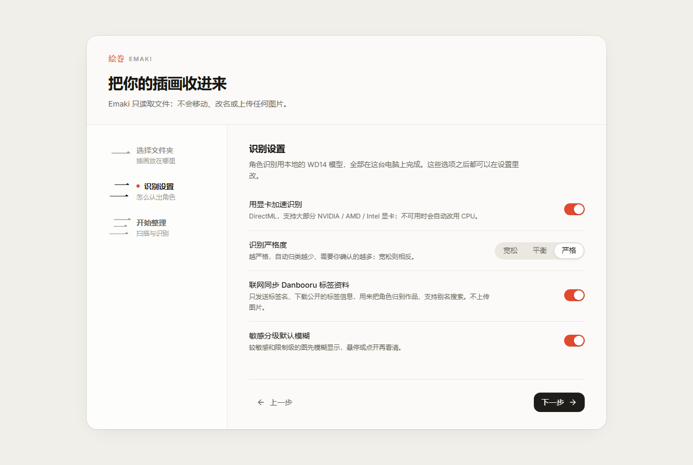
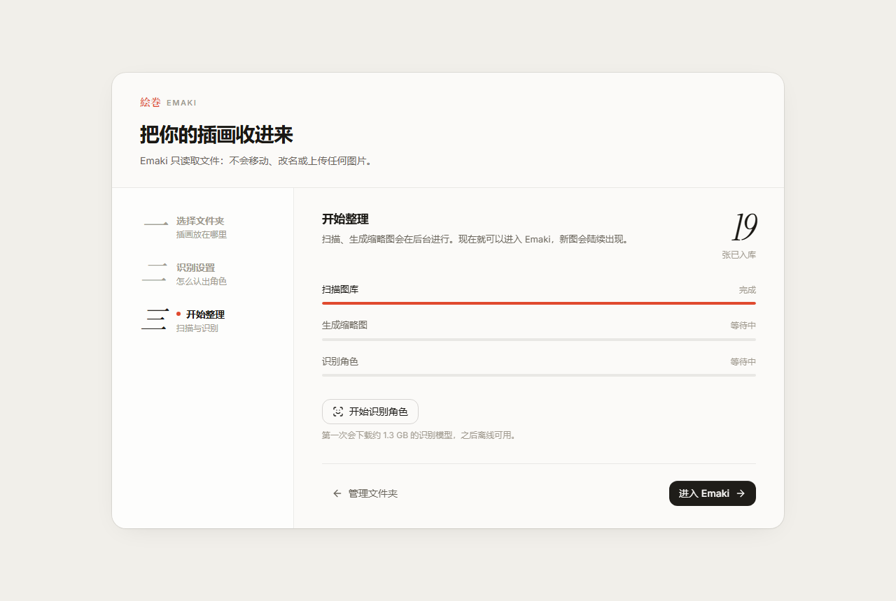
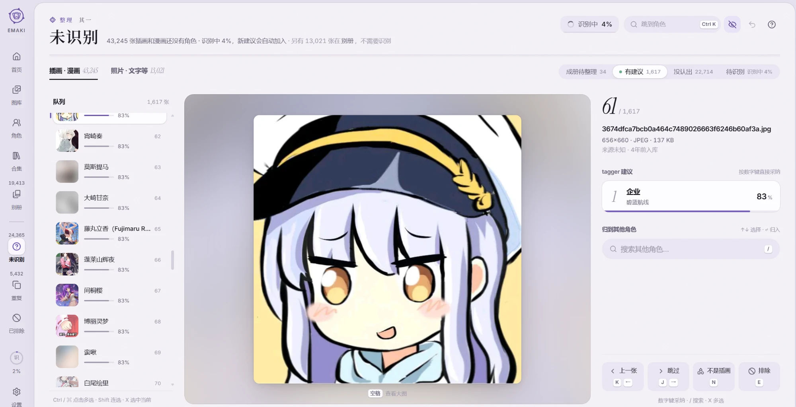
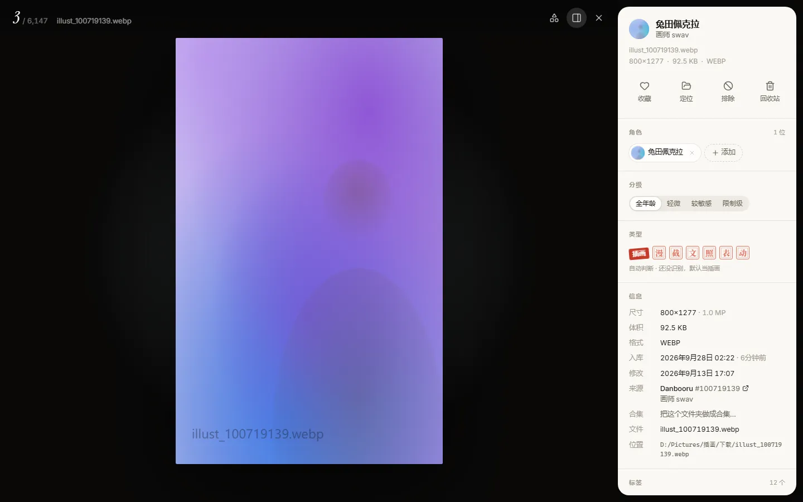
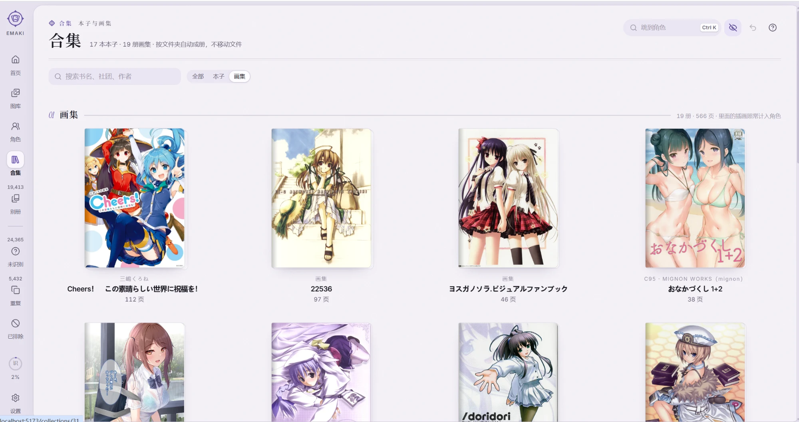

# Emaki 安装与使用图文教程

> Emaki 是**本地应用**：它运行在你自己的电脑上，用浏览器打开界面，图片不会上传到任何地方。

## 最省事的装法：免安装版

不想装 Node.js、不想敲命令的话，用这个就行：

1. 打开 [Releases 页面](https://github.com/nickname21kmr/emaki/releases/latest)，下载 `Emaki-x.x.x-win-x64.zip`（约 100 MB）。
2. 右键压缩包 →「全部解压缩」，解压到空间够的盘，比如 `D:\Emaki`（缩略图和识别模型会占好几 GB，不建议放 C 盘）。
3. 打开解压出来的文件夹，双击 **「启动 Emaki.cmd」**。

   因为是从网上下载的文件，第一次运行时 Windows 可能会弹出安全提示：如果是「Windows 已保护你的电脑」，点「更多信息」→「仍要运行」；如果是「打开文件 - 安全警告」，点「运行」。

4. 会弹出一个黑色窗口，几秒后浏览器自动打开 Emaki。**黑色窗口要一直开着**，关掉它 Emaki 就退出了。
5. 接下来按第 5 节的「首次使用引导」选图片文件夹就行。

以后每次用，都是双击「启动 Emaki.cmd」。升级时下载新版解压到新文件夹，把旧版里的 `data` 文件夹整个复制过去，你之前的整理记录都在里面。

下面第 1–4 节是从源码安装的步骤，用免安装版可以直接跳到[第 5 节](#5-首次使用引导)。

---

## 目录

1. [准备：安装 Node.js 和 Git](#1-准备安装-nodejs-和-git)
2. [从 GitHub 下载 Emaki](#2-从-github-下载-emaki)
3. [安装依赖](#3-安装依赖)
4. [启动](#4-启动)
5. [首次使用引导](#5-首次使用引导)
6. [日常使用](#6-日常使用)
7. [更新到新版本](#7-更新到新版本)
8. [备份与迁移](#8-备份与迁移)
9. [常见问题](#9-常见问题)
10. [附：维护这个 GitHub 仓库](#10-附维护这个-github-仓库)

---

## 1. 准备：安装 Node.js 和 Git

### Node.js（必需）

1. 打开 <https://nodejs.org/>，下载 **LTS（长期支持）版**安装包，版本需要 **22 或更新**（推荐 24）。
2. 双击安装，一路「Next」，保持默认选项即可。
3. 装好后打开一个**新的** PowerShell（开始菜单搜索「PowerShell」），输入：

   ```powershell
   node -v
   npm -v
   ```

   能看到类似 `v24.19.0` 和 `11.x.x` 的版本号就说明装好了。

### Git（推荐）

Git 用来下载和更新代码。打开 <https://git-scm.com/download/win> 下载安装，同样保持默认选项。装好后在新的 PowerShell 里输入 `git --version` 检查。

> 不想装 Git 也可以：第 2 步里用「下载 ZIP」的方式，只是以后更新要重新下载。

---

## 2. 从 GitHub 下载 Emaki

建议放在**非系统盘**（例如 F 盘），数据库、缩略图缓存和约 2 GB 的识别模型默认都放在项目目录里。

### 方式 A：用 Git 克隆（推荐，方便以后更新）

```powershell
cd F:\
git clone https://github.com/nickname21kmr/emaki.git
cd emaki
```

仓库是**私有**的：第一次克隆时会弹出 GitHub 登录窗口，用有权限的账号登录即可（Git for Windows 自带的凭据管理器会记住登录状态）。

### 方式 B：下载 ZIP

1. 在浏览器里打开仓库页面（需要先登录 GitHub）。
2. 点绿色的 **Code** 按钮 → **Download ZIP**。
3. 把压缩包解压到 `F:\emaki`（解压后确认 `F:\emaki\package.json` 这个文件存在）。

---

## 3. 安装依赖

在项目目录里打开 PowerShell（在文件夹空白处按住 Shift 右键 →「在此处打开 PowerShell 窗口」），执行：

```powershell
npm install
```

第一次安装需要下载几百 MB 的依赖，耐心等它跑完。最后出现 `added xxx packages` 就成功了（出现几行 `npm warn` 是正常的）。

> **国内下载慢？** 先执行下面这行，改用国内镜像再安装：
>
> ```powershell
> npm config set registry https://registry.npmmirror.com
> ```

---

## 4. 启动

```powershell
npm run dev
```

看到类似下面两行，说明后端和前端都起来了：

```
[server] Emaki 后端已启动：http://127.0.0.1:5174（数据源：sqlite）
[web]    ➜  Local:   http://localhost:5173/
```

用浏览器打开 **<http://localhost:5173>** 就能用了。

- 这个 PowerShell 窗口要**一直开着**，关掉窗口或按 `Ctrl + C` 就会停止 Emaki。
- 下次使用：进到项目目录，再执行一次 `npm run dev`。

> **只想先看看界面？** 执行 `npm run dev:mock`，会用约 9,000 张演示占位图启动，改动不会保存，也不会碰你的真实数据。

---

## 5. 首次使用引导

第一次打开会自动进入三步引导。

### 第一步：选择文件夹



- 在输入框里填入你存放插画的文件夹，例如 `D:\Pictures\插画`；也可以点「浏览…」选择。
- 可以添加多个文件夹，子文件夹会一起扫描。也支持网络路径（`\\NAS\共享文件夹`）。
- 在资源管理器地址栏里复制路径，直接粘贴进来就行。

Emaki **只读取**这些文件夹：不会移动、改名或修改任何文件。

### 第二步：识别设置



| 选项 | 说明 | 建议 |
| --- | --- | --- |
| 用显卡加速识别 | 用显卡跑识别模型，比 CPU 快很多；不可用时自动改用 CPU | 有独立显卡就打开 |
| 识别严格度 | 越严格，自动归类的越少、需要你确认的越多 | 先用「平衡」 |
| 联网同步 Danbooru 标签资料 | 只发送标签名、下载公开的标签信息，用来把角色归到作品、支持别名搜索；**不上传图片** | 打开 |
| 敏感分级默认模糊 | 较敏感和限制级的图先模糊显示 | 按个人习惯 |

这些之后都可以在「设置」里改。

### 第三步：开始整理



- 扫描和生成缩略图会在后台进行，现在就可以点「进入 Emaki」。
- 点「开始识别角色」：**第一次会下载约 2 GB 的识别模型**，下载完之后离线也能用。下载进度在这个页面和左侧栏的进度环里都能看到。
- 图片很多时，识别需要一段时间（几万张大约要几个小时，取决于显卡）。识别过程中可以正常浏览，新认出的角色会陆续出现。

---

## 6. 日常使用

### 角色页


- 顶部的作品标签可以切换作品；「你最常看的」按张数排行。
- 搜索框支持中文名、日文名、罗马音和别名，例如「未花」「ミカ」「mika」都能找到同一个角色。
- 任何页面按 **Ctrl + K** 都能快速跳到某个角色。

### 未识别：快速归类



模型没把握的图会放在这里，右边是识别建议：

| 按键 | 作用 |
| --- | --- |
| `1` `2` `3` | 采纳第 1、2、3 条建议 |
| `/` | 搜索其他角色 |
| `J` / `→` | 跳过 |
| `K` / `←` | 上一张 |
| `E` | 排除这张 |

### 看图器



在任何网格里点一张图打开。`←` `→` 切换，`I` 显示或隐藏信息面板，`F` 收藏，滚轮或双击放大。右侧可以直接修改角色、分级和类型。

### 合集和别册



- **合集**：一个文件夹里按页码命名的图（本子、画集）会自动成册，点开按页码顺序阅读。
- **别册**：漫画、截图、文字图、照片、表情包、动图会自动分开放，不计入角色张数，也不会堆在「未识别」里。

### 其他常用操作

- **撤销**：所有修改都可以撤销，按 `Ctrl + Z`，或点右上角的撤销按钮。
- **模糊敏感图**：按 `B` 切换。
- **暗色主题**：设置 → 外观。
- **全部快捷键**：按 `?`。

---

## 7. 更新到新版本

先在运行 Emaki 的窗口按 `Ctrl + C` 停止，然后：

```powershell
git pull
npm install
npm run dev
```

数据库结构有变化时，启动时会自动升级，并在 `data` 目录里留一份升级前的备份（`emaki.vN.bak.sqlite`）。

用 ZIP 方式安装的：下载新的 ZIP 解压到新文件夹，把旧目录里的 `data` 文件夹整个复制过去，再执行 `npm install`。

---

## 8. 备份与迁移

你在 Emaki 里做的所有整理（角色归类、合集、排除、收藏）都存在 **`data\emaki.sqlite`** 里。

- **备份**：停止 Emaki 后，复制整个 `data` 文件夹即可。只想省空间的话，至少备份 `emaki.sqlite`；缩略图和模型都可以重新生成、重新下载。
- **换电脑**：在新电脑上按本教程装好 Emaki，把 `data` 文件夹复制进项目目录。如果图片所在的盘符变了，到「设置 → 图库文件夹」里重新添加一次。

---

## 9. 常见问题

**打开 localhost:5173 显示「无法访问」**
确认运行 `npm run dev` 的窗口还开着、没有报错。如果提示 `EADDRINUSE`（端口被占用），说明已经有一个 Emaki 在运行，或者被其他程序占用了；关掉其他窗口再试。

**页面提示「连不上后端」**
后端没启动或已经崩溃。看一下 `npm run dev` 窗口里 `[server]` 开头的报错信息。

**模型下载很慢或失败**
Emaki 会同时测试 huggingface.co、hf-mirror.com、ModelScope 三个下载源，自动选最快的。如果你用代理（比如 Clash），在项目目录新建一个 `.env` 文件（可以复制 `.env.example` 再改名），写入：

```
EMAKI_HTTP_PROXY=http://127.0.0.1:7890
```

然后重启 Emaki。也可以只用国内镜像：`HF_ENDPOINT=https://hf-mirror.com`。

**显卡加速不可用**
设置页会显示原因，并已自动改用 CPU（慢一些但结果一样）。确认显卡驱动是最新的，笔记本请让浏览器和 Node.js 使用独立显卡。

**识别出来的角色不对 / 认不出新角色**
识别模型是用 Danbooru 上的数据训练的，太新的角色（模型训练之后才出的）、太冷门的角色和原创角色认不出来。在「未识别」页手动归类，或者新建「自建角色」。

**想换一个地方放数据库和缩略图**
在 `.env` 里写 `EMAKI_DATA_DIR=F:/EmakiData`，然后重启。

**会不会删我的图？**
不会。Emaki 只读取文件，唯一会动文件的操作是「移到回收站」，它需要你手动触发，而且移进的是**系统回收站**，可以从回收站还原。

---

## 10. 附：维护这个 GitHub 仓库

本节写给仓库维护者。

### 提交并推送改动

```powershell
git add -A
git commit -m "说明这次改了什么"
git push
```

`data/`、`node_modules/`、`.env`、模型文件（`*.onnx`）和数据库（`*.sqlite`）都在 `.gitignore` 里，**不会**被提交。提交前可以用 `git status` 确认一遍。

### 用 GitHub CLI 查看仓库

```powershell
gh repo view --web            # 在浏览器里打开仓库页面
gh repo edit --visibility public --accept-visibility-change-consequences   # 改成公开（慎重）
```

### 给别人访问权限（私有仓库）

仓库页面 → **Settings** → **Collaborators** → **Add people**，输入对方的 GitHub 用户名。
